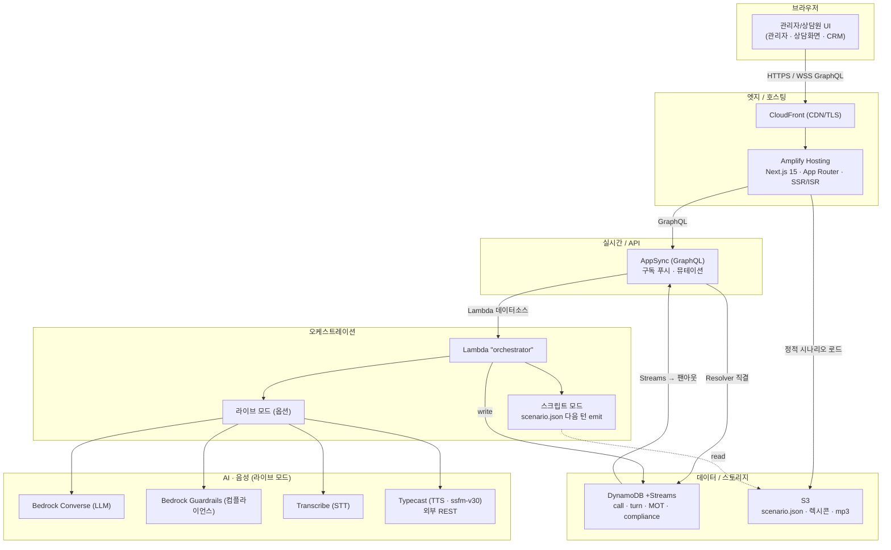

# AI 상담 코파일럿 — Next.js + AWS 아키텍처 설계 (부스 데모)

> 상태: 설계안 (2026-06-19)
> **SSOT: `data/consult_merged-4.html`** — 화면 구성·시나리오·연출의 단일 진실 원천.
> ⚠️ `hk-skills/reference/PRODUCT-BRIEF.md`, `README.md`는 **outdated** — 본 설계는 HTML을 기준으로 한다.
> 범위: **부스 데모용(가볍게)**. 운영 헤비 자원(Fargate 클러스터/Aurora/Step Functions/Cognito/VPC) 배제,
> 빠르게 띄우는 **서버리스 매니지드 AWS**로 "AWS 최대 활용"을 만족시킨다.

---

## 0. SSOT(HTML)가 정의하는 현재 제품

`consult_merged-4.html`은 **완전 스크립트 기반 단일 페이지 데모**다. 좌측 사이드바 3개 뷰 + 진입용 세그먼트 화면으로 구성:

| 뷰 (HTML) | 역할 | 데이터 출처(HTML) |
|-----------|------|------------------|
| **관리자 화면** (`#view-admin`) | 콜 리스트 + 요약 통계. 행 클릭 → 세그먼트 분석 진입 | `CALLS[]`, `AGENTS[]` 하드코딩 |
| **사전 고객분석** (`#view-segment`) | 세그먼트 군집 애니메이션 → 분석 완료 → (현재) 자동 발신 | `sgPlay()` / `runDial()` |
| **AI 상담화면** (`#view-consult`) | STT 여정 + AI 응답 준비(발화분석·DB·전략) + 컴플라이언스 + 항법 맵 | `S[]`(18턴), `PICK[]`, `REASON[]`, `EMO9/DB9` |
| **상담 CRM** (`#view-summary`) | 통화 종료 요약 + 대기 상담사 | 정적 마크업 + `AGENTS[]` |

**핵심**: 모든 발화·분석·확률·전략이 JS 배열에 하드코딩되어 있다. 즉 부스 데모의 "제품"은 이 **결정론적 시나리오 재생**이다. → AWS 백엔드는 *시나리오 재생에는 필수가 아니며*, "실제 AI 모드"를 옵션으로 얹는 구조가 가볍고 안전하다.

---

## 1. 이번 UI 변경 → 시스템 영향 (HTML 기준)

| # | 변경 | HTML 현 위치 | 시스템/데이터 영향 |
|---|------|-------------|-------------------|
| 1 | 클릭 시 자동발신 금지 → **통화 버튼** | `sgAt(10200,()=>runDial())` 자동호출 | `runDial()`을 버튼 `onClick`으로. 분석↔발신 **분리** |
| 2a | 긍정 키워드 **초록** | `.kw.k-go`(파랑)/`.k-risk`(빨강) | `k-go` → 초록(`--go`)로 스타일 변경. 토큰 `polarity` 유지 |
| 2b | 활성화 **사유 아코디언** | 현재 사유 없음 | 토큰에 `reason` 추가, 키워드 클릭 시 확장 |
| 2c | "DB 분석" → **"상담 전략"**(큰 텍스트 위/Data 축소 아래) | `#card-db` "DB 분석" | 전략 `headline`(주) + Data 칩(보조)로 재배치 |
| 2d | **Next action 제거**, 전략 영역 확장 | `#card-strat` "next action" | 카드③ 삭제, 카드② grid 확장 |
| 2e | 컴플라이언스 **작성→리뷰→삭제→재작성** 텍스트창 | `runCompliance()`(1→4 체크만) | 생성 루프 + 텍스트창 상태머신 |
| 2f | 여정에 **MOT 마커** + 클릭 플로팅 | `rz-*`(위험)/`cp-*`(체크포인트) 노드 | 신규 **MOT** 엔터티, 클릭 시 모먼트/전략/결과 |
| 3 | CRM에 **MOT 영역** | `#view-summary` | MOT 타임라인/디테일 보드 |

신규 도메인 개념: **MOT(Moment of Truth)**, **ComplianceReview**.

---

## 2. 부스 데모 아키텍처 (라이트 서버리스)



> 공통(경량): IAM · CloudWatch. 운영 헤비 자원은 §2.2 사유로 배제.
> TTS는 AWS 외부 **Typecast**(REST, `ssfm-v30`, 화자 혜라/진서/유라) — Lambda가 `X-API-KEY`로 호출. SSOT: `hk-skills/reference/STACK.md` §4.

### 2.1 두 가지 실행 모드 (부스 핵심 전략)
- **스크립트 모드(기본·발표용)**: HTML의 `S[]`·`PICK[]`·`REASON[]`을 **S3의 `scenario.json`**으로 옮기고, Lambda가 "다음 턴"을 AppSync로 emit. 네트워크/AI 장애와 무관하게 **항상 동일하게 재생** → 부스에서 가장 안전.
- **라이브 모드(옵션·시연 하이라이트)**: 같은 인터페이스로 Bedrock/Transcribe/Typecast 실제 호출. 토글 한 번으로 전환.

> 두 모드가 **동일한 AppSync 이벤트 계약**을 쓰므로 프론트는 모드를 모른다 → 데모 안정성과 "실제 AWS AI" 시연을 동시에 만족.

### 2.2 왜 라이트한가 (배제한 것과 이유)
| 배제 | 이유(부스 데모) |
|------|----------------|
| ECS Fargate / VPC | 상주 오디오 서버가 필수가 아님(스크립트 모드). 라이브도 단발 Lambda+Transcribe로 충분 |
| Aurora / Step Functions | 종료 요약은 DynamoDB + 단일 Lambda로. 관계형 영속 불필요 |
| Cognito / WAF | 단일 부스·무인증 데모. Amplify 기본 보호로 충분 |
| EventBridge 버스 | DynamoDB Streams → Lambda → AppSync 한 줄 팬아웃으로 대체 |

---

## 3. 프론트엔드 (Next.js 15 / React 19 / Tailwind)

### 3.1 라우트 (HTML 3뷰 + 세그먼트를 그대로 라우트화)
```
app/
  (admin)/page.tsx               # 관리자 화면 (CALLS 큐 + 요약카드)
  segment/[customerId]/page.tsx  # 사전 고객분석 + ★통화 버튼
  calls/[id]/page.tsx            # AI 상담화면
  crm/[id]/page.tsx              # 상담 CRM (+MOT 영역)
components/consult/
  SpeechAnalysis.tsx   # 카드① 발화분석: PRO=초록/CONS=빨강 + 사유 아코디언
  StrategyPanel.tsx    # 카드② "상담 전략"(headline 큰글씨) + Data 칩(축소)
  CompliancePanel.tsx  # 작성→리뷰→삭제→재작성 텍스트창
  JourneyMap.tsx       # 여정 + MOT 마커
  MotFloating.tsx      # MOT 클릭 플로팅
components/crm/MotBoard.tsx
lib/appsync.ts · lib/store(Zustand: call/queue/mot)
```

### 3.2 변경별 구현 메모 (HTML 매핑)
- **(1)** `#view-segment`의 `sgPlay()` 끝 `runDial()` 자동호출 제거 → 분석 완료 후 **`통화` 버튼** 렌더, 클릭 시 `dialCall` 뮤테이션(→`DIALING`) 후 상담화면 전환.
- **(2a)** CSS: `.msg--cust .bubble .kw.k-go{color:var(--go);background:#E3F6EC}` (현재 파랑→초록). `k-risk`는 빨강 유지.
- **(2b)** 키워드 `<button class="kw">` → 클릭 시 `aria-expanded` 토글, 아래 `.kw-reason`(`max-height` 트랜지션)에 `token.reason` 노출.
- **(2c/2d)** `#card-strat`(next action) 제거. `#card-db` 제목 "상담 전략", 상단 `strategy.headline`(예: `REASON[i].what`을 큰 텍스트)·`strategy.rationale`, 하단에 기존 `DB9` 매핑을 작은 칩으로. `cc__cards` grid를 3열→2열로 넓힘.
- **(2e)** `CompliancePanel` 상태: `drafting`(AI가 답변 타이핑)→`reviewing`(검수)→위반 시 `redacting`(텍스트 줄긋고 삭제)→`redrafting`→`approved`. 각 전이는 AppSync `onComplianceState` 수신.
- **(2f)** `JourneyMap`이 `mot[]`를 받아 `rz-*`(위험)/전환 턴에 **MOT 아이콘**. 클릭 → `MotFloating`에 `{type, momentLabel, strategy, outcome, narrative, churnBefore→After}`.
- **(3)** `MotBoard`: 통화 전체 MOT 타임라인 + 카드별 디테일.

### 3.3 호스팅: **AWS Amplify Hosting** (Next.js SSR 네이티브 + 깃 CI/CD + CloudFront 자동). 부스용으로 셋업 최소.

---

## 4. 데이터 모델 — DynamoDB 싱글 테이블 (+Streams)

| 엔터티 | PK / SK | 핵심 필드 |
|--------|---------|-----------|
| Call | `CALL#{id}` / `META` | `state, customer_id, started_at, ended_at` |
| Turn | `CALL#{id}` / `TURN#{seq}` | `speaker, text, tokens[{text,polarity,reason}], churn_after, node` |
| **MOT** | `CALL#{id}` / `MOT#{seq}` | `type(RISK\|CONVERSION), turnSeq, churnBefore, churnAfter, triggers[], strategy{tactic,headline}, outcome(defended\|converted\|lost), narrative` |
| **ComplianceReview** | `CALL#{id}` / `CMPL#{turn}#{try}` | `draft, verdict, violatedPolicies[], action(approved\|rewritten)` |

- 영속/CRM도 동일 테이블에서 조회(부스 규모). 종료 시 단일 Lambda가 turn/MOT를 읽어 `summary` 아이템 생성.
- 정적 시나리오·렉시콘(`churn_risk_lexicon.json`)·mp3는 **S3**.

---

## 5. AppSync 이벤트 계약 (모드 공통)
구독(모두 `callId` 인자): `onQueueUpdate`, `onTurn`, `onIndexUpdate`(이탈위험·감정), `onSpeechAnalysis`(토큰 polarity/reason), `onStrategyUpdate`(전략 headline), `onComplianceState`(drafting/reviewing/redacting/redrafting/approved), `onMotDetected`, `onCallEnded`.
뮤테이션: `createCall`(분석만), **`dialCall`**(통화 버튼), `nextTurn`(스크립트 모드 진행), `endCall`.

---

## 6. MOT 탐지 규칙 (신규 로직, 렉시콘 기반)
매 고객 턴 후 평가:
- **RISK MOT**: `churnAfter - churnBefore ≥ +12` 또는 `churnAfter ≥ 60` (CONS 급등). HTML의 `risk:{...}` 턴과 매핑.
- **CONVERSION MOT**: `TRANSFER_INTENT`/`BUYING_INTENT` 매칭 턴(전환 분기).
- `outcome`: 직전 AI 전략 후 churn 하락=`defended`, 전환=`converted`, 이탈=`lost`.
- `narrative`: 스크립트 모드는 `REASON[i]`로 1줄 구성, 라이브 모드는 Bedrock 1줄 생성.
→ 여정 마커(2f)·플로팅·CRM 보드(3)가 같은 MOT 레코드 공유.

## 7. 컴플라이언스 루프 (라이브 모드; 스크립트 모드는 사전기록 재생)
```
draft = Bedrock.converse(prompt)        # onComplianceState: drafting
v = Guardrails.apply(draft)             # reviewing
while v.blocked and try<2:
  log ComplianceReview(violation,draft) # redacting (텍스트 삭제 연출)
  draft = Bedrock.converse(prompt+회피지시) # redrafting
  v = Guardrails.apply(draft)
emit approved → Typecast(TTS)
```
스크립트 모드에선 위 단계 타임라인을 `scenario.json`에 미리 넣어 동일 연출 재생(부스 안정성).

---

## 8. 다음 단계
- 본 문서 확정 후 **AWS CDK(TypeScript) 스캐폴드** 생성 가능: Amplify·AppSync(스키마)·DynamoDB·Lambda·S3·Bedrock IAM. (이번엔 설계 문서까지.)
- `scenario.json` 스키마는 HTML의 `S[]/PICK[]/REASON[]/EMO9/DB9`를 1:1 직렬화.

## 9. 기존(outdated) 계획 대비 변경
| 영역 | 기존 문서(outdated) | 본 설계(부스/HTML 기준) |
|------|--------------------|------------------------|
| SSOT | PRODUCT-BRIEF.md | **consult_merged-4.html** |
| 백엔드 | FastAPI 상주 + DuckDB | Amplify + AppSync + Lambda + DynamoDB |
| 실시간 | 자체 WebSocket | AppSync 구독 |
| 실행 | 라이브 STT 전제 | **스크립트 모드 기본** + 라이브 옵션 |
| 신규 도메인 | — | **MOT**, **ComplianceReview** |
